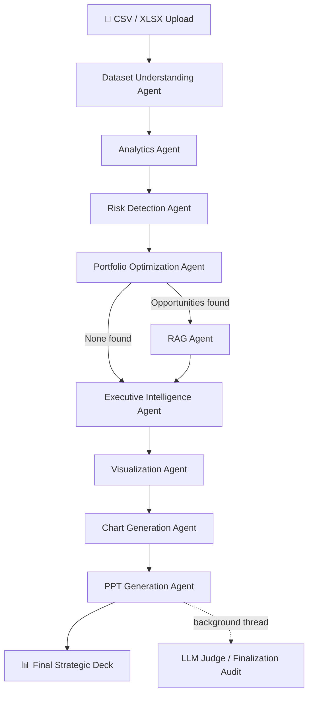

# 🚀 Pharmaceutical Portfolio Intelligence Platform

**A multi-agent LangGraph pipeline that turns raw pharmaceutical sales data into a boardroom-ready strategic PowerPoint report — fully autonomous, RAG-grounded, and accelerated on AMD ROCm + vLLM.**

<p align="center">
  
  
  
  
  
</p>

> Built for the **TCS x AMD Hackathon**. The generator and judge LLMs in this pipeline are executed on **AMD ROCm-powered GPUs, served through vLLM**, demonstrating an end-to-end agentic AI workload running natively on the AMD stack.

---

## 📖 Overview

Pharmaceutical portfolio managers are buried in raw transactional sales data (hourly, daily, weekly, monthly) but need **executive-level, WHO-aligned strategic insight** — fast. This platform automates that entire journey with a chain of **9 specialized agents** orchestrated through **LangGraph**, wrapped in a live **Gradio** dashboard.

Drop in a sales CSV/XLSX file and the pipeline will:

1. Understand the dataset's structure automatically
2. Compute portfolio KPIs and growth analytics
3. Detect concentration, volatility, and anomaly risks
4. Score and optimize the portfolio using Isolation Forest
5. Retrieve grounded strategic guidance from a WHO/pharma knowledge base (RAG)
6. Synthesize a McKinsey/BCG-style executive report via LLM
7. Plan and render data visualizations
8. Generate a polished, presentation-ready **PowerPoint deck**
9. Run a background LLM-as-judge audit to score its own accuracy and coverage

All of this streams live into a dashboard with per-agent progress badges, accuracy/coverage gauges, and a one-click PPTX download.

---

## 🖥️ AMD ROCm + vLLM Acceleration

This project's language-model backbone was executed on an **AMD GPU stack**:

- **Runtime:** ROCm (AMD's open compute platform for GPU acceleration)
- **Inference server:** vLLM, configured with the ROCm backend for high-throughput, low-latency generation
- **Models served:**
  - `Qwen/Qwen3-4B` — primary generator for the executive intelligence report
  - `Qwen/Qwen2.5-7B-Instruct` — lazy-loaded LLM-judge used for the automated accuracy/coverage audit

Running both the report-generation and self-evaluation loops on ROCm + vLLM let the pipeline keep multi-agent latency low even though two separate LLMs are invoked per run (one for synthesis, one for auditing). If you don't have access to an AMD GPU, the code also runs on the standard Hugging Face `transformers` pipeline (see [LLM Backend](#-llm-backend) below) — swap in vLLM's OpenAI-compatible server for the accelerated path.

---

## 🏗️ Architecture

The core pipeline is a directed graph built with **LangGraph**, with one conditional branch (RAG is only invoked when optimization opportunities are actually found):



### Agent Roster

| # | Agent | Responsibility |
|---|-------|-----------------|
| 1 | **Dataset Understanding Agent** | Auto-detects date columns, sales metric columns, and dataset shape/schema |
| 2 | **Analytics Agent** | Computes portfolio KPIs, category performance, contribution %, growth trends |
| 3 | **Risk Detection Agent** | Flags concentration risk (HHI), growth volatility, and category-level risk severity |
| 4 | **Portfolio Optimization Agent** | Calculates a calibrated Portfolio Health Score and runs Isolation Forest anomaly detection over category features |
| 5 | **RAG Agent** | Routes detected risks/opportunities to a FAISS vector store built over WHO and pharma-strategy PDFs, retrieving grounded strategic context |
| 6 | **Executive Intelligence Agent** | Prompts the generator LLM to write a McKinsey/BCG/Bain-style boardroom report from the structured findings + RAG context |
| 7 | **Visualization Agent** | Plans which charts best represent the analytics, risk, and optimization outputs |
| 8 | **Chart Generation Agent** | Renders the planned charts (health score, sales contribution, growth trend, risk dashboard) with Matplotlib |
| 9 | **PPT Generation Agent** | Assembles a dark-themed, boardroom-ready `.pptx` deck with `python-pptx`, embedding all charts and the executive narrative |

A tenth step, the **Finalization / Judge Node**, runs asynchronously after the deck is delivered: it prompts the judge LLM to compare the generated report against the ground-truth analytics and writes an `accuracy` / `coverage` / `verdict` JSON that the UI polls and visualizes as live gauges.

---

## 🔍 Retrieval-Augmented Generation (RAG)

The **Knowledge Base** is built from a curated set of pharmaceutical and WHO policy documents:

- `pharma_strategy_framework.pdf`
- `Pharmaceutical Portfolio Management.pdf`
- `Pharmaceutical Sales Forecasting and Demand Planning.pdf`
- `Underperforming Product Management and Portfolio Optimization.pdf`
- `who_medicines_strategy.pdf`
- `who_pricing_policy.pdf`
- `who_regulatory_strengthening.pdf`
- `pharmaceutical_systems_strengthening.pdf`

**Pipeline:** `document_loader.py` → `text_chunker.py` → `vector_store.py` (FAISS index) → `retriever.py` (`sentence-transformers/all-MiniLM-L6-v2` embeddings).

Retrieval queries are dynamically constructed from the specific risk/opportunity types the Portfolio Optimization Agent surfaces (e.g. *"portfolio concentration"* → diversification strategy docs, *"volatility"* → demand-forecasting docs, *"low contribution"* → underperforming-product docs). Retrieval metrics (avg/best similarity score, search time, chunk count) are logged to `results/rag_metrics.csv` for every run.

---

## 📁 Project Structure

```
.
├── agents/                        # All specialized analytical agents
│   ├── dataset_understanding_agent.py
│   ├── analytics_agent.py
│   ├── risk_detection_agent.py
│   ├── portfolio_optimization_agent.py
│   ├── executive_intelligence_agent.py
│   ├── visualization_agent.py
│   ├── chart_generation_agent.py
│   └── ppt_agent.py
├── graph/                         # LangGraph orchestration layer
│   ├── state.py                   # Shared AgentState schema
│   ├── nodes.py                   # Node wrappers, caching, telemetry, judge audit
│   └── workflow.py                # Graph definition & conditional routing
├── rag/                           # Retrieval-Augmented Generation stack
│   ├── document_loader.py
│   ├── text_chunker.py
│   ├── vector_store.py
│   ├── retriever.py
│   └── rag_agent.py
├── knowledge_base/                # Source PDFs for the RAG vector store
├── vector_db/                     # Persisted FAISS index (index.faiss / index.pkl)
├── data/                          # Sample pharma sales datasets (hourly/daily/weekly/monthly)
├── models/                        # Persisted Isolation Forest model (portfolio_iforest.pkl)
├── outputs/ , ppt/                # Generated charts and PPTX reports
├── cache/                         # SQLite agent cache + RAG embedding cache
├── results/                       # Evaluation metrics, judge verdicts, telemetry
├── assets/                        # UI media (intro video, WHO emblem)
├── llm.py                         # LLM backend (generator + judge model loading/inference)
├── build_kb.py                    # One-off script to build the FAISS knowledge base
├── gradio_app.py                  # Gradio dashboard / entry point
└── requirements.txt
```

---

## ⚙️ LLM Backend

`llm.py` exposes two functions used throughout the graph:

- **`generate(prompt)`** — used by the Executive Intelligence Agent to synthesize the boardroom report (`Qwen/Qwen3-4B`)
- **`generate_judge_assessment(prompt)`** — lazy-loaded LLM-as-judge used by the finalization node to score accuracy/coverage against ground truth (`Qwen/Qwen2.5-7B-Instruct`)

The default implementation loads both models with Hugging Face `transformers.pipeline(...)`. On AMD hardware, install the ROCm build of PyTorch and point the same interface at a **vLLM** server (native ROCm support) for significantly higher throughput, e.g.:

```bash
# Serve the generator on vLLM (ROCm backend)
vllm serve Qwen/Qwen3-4B --host 0.0.0.0 --port 8000

# Serve the judge model
vllm serve Qwen/Qwen2.5-7B-Instruct --host 0.0.0.0 --port 8001
```

Then swap the `pipeline(...)` calls in `llm.py` for OpenAI-compatible client calls against the local vLLM endpoints.

---

## 🛠️ Tech Stack

| Layer | Technology |
|---|---|
| Orchestration | LangGraph |
| LLM Inference | Qwen3-4B & Qwen2.5-7B-Instruct, served via ROCm + vLLM (AMD-accelerated) |
| RAG / Embeddings | LangChain, FAISS, `sentence-transformers/all-MiniLM-L6-v2` |
| ML / Anomaly Detection | scikit-learn (Isolation Forest) |
| Data Processing | pandas, numpy |
| Visualization | Matplotlib, Plotly |
| Report Generation | python-pptx |
| Evaluation | `evaluate`, `rouge-score`, `sacrebleu`, `bert-score`, `ragas` |
| UI | Gradio |

---

## 🚦 Getting Started

### 1. Clone & install dependencies

```bash
git clone <your-repo-url>
cd TCS-AMD-HACK-V2
pip install -r requirements.txt
```

> **AMD GPU users:** install the ROCm build of PyTorch (matching your ROCm driver version) before installing the rest of the requirements, then optionally install `vllm` for accelerated serving.

### 2. Build the RAG knowledge base

```bash
python build_kb.py
```

This chunks and embeds the PDFs in `knowledge_base/` and persists the FAISS index to `vector_db/`.

### 3. Launch the dashboard

```bash
python gradio_app.py
```

Open the local (or shared) Gradio URL, upload a sales dataset (`.csv` / `.xlsx`), and click **🚀 Launch Intelligence Engine**. Watch the nine agents complete in real time, then download the generated strategic PPTX.

### Sample data

Sample pharmaceutical sales datasets at multiple granularities are included under `data/`:

- `saleshourly.csv`
- `salesdaily.csv`
- `salesweekly.csv`
- `salesmonthly.csv`

---

## 📊 Evaluation & Self-Auditing

Every generated report is automatically graded by an LLM judge that compares the narrative against the underlying ground-truth analytics. The verdict is written to `results/latest_metrics.json` and polled live by the UI, which renders **Accuracy** and **Coverage** as gauge charts alongside a written assessment (`ACCURATE` / `PARTIAL` / `INACCURATE`). Historical runs are appended to `results/evaluation_results.txt`, and RAG retrieval quality is tracked per-query in `results/rag_metrics.csv`.

---

## 🧩 Key Design Notes

- **Persistent + in-memory caching** (`graph/nodes.py`) hashes the uploaded file so re-running the same dataset skips redundant agent work, and a SQLite-backed cache (`cache/agent_cache.db`) memoizes the executive report by analytics+risk fingerprint.
- **Conditional RAG routing** — the graph only calls the RAG agent when the Portfolio Optimization Agent actually surfaces improvement opportunities, saving a retrieval + generation round-trip when the portfolio is already healthy.
- **Background auditing** — the judge LLM call runs in a daemon thread after the PPTX is already handed to the user, so evaluation latency never blocks the download.

---

## 📄 License

This project was developed for the TCS x AMD Hackathon. Add your preferred license here (e.g. MIT) before publishing.

---

<p align="center"><sub>Executive intelligence, agent by agent — accelerated on AMD ROCm + vLLM.</sub></p>
